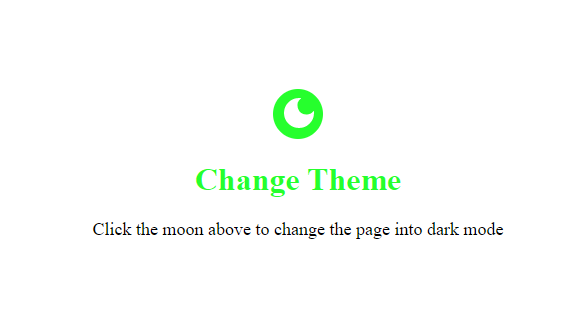
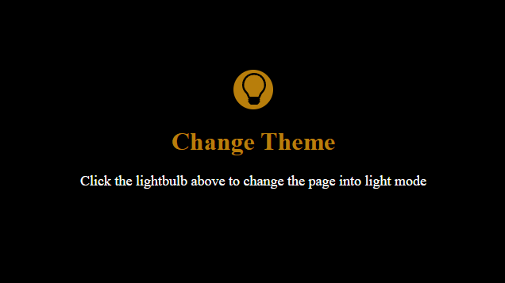

# Creating a Dark Mode In React

Using React's library called styled-components, a dark mode can be created for the same web page using manufactured css in javascript. A toggle button indicated by a moon or a sun is used to switch between modes.

Light Mode:

Dark Mode:

